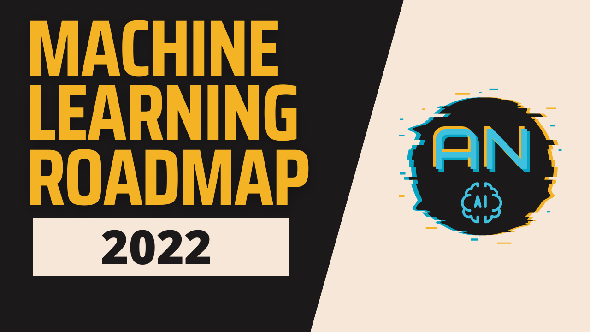

# ML-Roadmap-for-2023
A curated list of Machine learning Roadmap. This roadmap contain all topics that I learnt when I was in the miracle of ML.
My suggestions will be just follow this roadmap more amazing things will come soon.

## 1. Python

#### 1.1 Learn Python - https://github.com/analyticalnahid/Python-Tutorial-For-Datascience
        1. Basics of Python
           - Syntax
           - Control Statement 
           - Loop
        2. Functional Programming   
        3. OOP in Python
           - Class & Object
           - Inheritance
           - Polymorphism
           - Encapsulation
           - Abstraction
        4. Advance Topics
           - File Handling
           - Exception Handling 
           - Regular Expressions (mostly required in NLP)
           - Basics of Flask/Django (web projects)
           - Streamlit - https://github.com/analyticalnahid/Streamlit-Tutorial
           - Gradio
           - Basic of Tkinter (gui based application) - https://github.com/analyticalnahid/Tkinter-Tutorial
           - BeautifulSoap (web scraping)
           - FastApi & Postman (working with api)
        5. Practice Problems

#### 1.2 Learn Numpy
        1. Numpy Tutorial - https://github.com/analyticalnahid/Numpy-Tutorial
        2. Numpy Practice Problems - https://github.com/rougier/numpy-100

#### 1.3 Learn Pandas
        1. Pandas Tutorial - https://github.com/analyticalnahid/Pandas-Tutorial
        2. Pandas Practice Problems - https://github.com/ajcr/100-pandas-puzzles

#### 1.4 Learn Data Visualization
        1. Matplotlib Tutorial - https://github.com/analyticalnahid/Matplotlib-Tutorial
        2. Seaborn Tutorial - https://github.com/analyticalnahid/Seaborn-Tutorial
        3. Poltly Tutorial - https://github.com/analyticalnahid/Plotly-Tutorial
        4. Practice Problems

## 2. SQL - https://github.com/analyticalnahid/SQL-Tutorial-For-Datascience
        Understanding Basic Strucutre Of SQL Table
        Comment
        Database Keys 
        Entity Relationship Diagram
        Cardinality of relationship 
        Data Types 
        Operator
        SQL Table & Columns
        Data Integrity & Constraints
        SQL Wildcard
        SQL Function
        Soritng Data  & Grouping Data
        SQL Join
        SQL Union

## 3. Mathematics (basic)

#### 3.1 Statistics
        1. Descriptive Statistics
        2. Inferential Statistics
        3. Advance Statistics
           - Covariance
           - Pearson Correlation Coefficient
           - QQ Plot
           - Confidence Interval
           - Hypothesis Testing
           - Chisquare Test, Anova Test
           
####  3.2 Probability Basics
        1. Conditional Probability
        2. Independent & Dependent Events
        3. Bayes Theorem
        4. Uniform Distribution
        5. Binomial Distribution
        6. Bernaulli Distribution
        7. Poission Distribution        
           
#### 3.3 Linear Algebra Basics
        1. Representing Tabular Data
        2. Vectors
        3. Matrices
        4. Matrix Multiplication
        5. Dot Product
        6. Equation of line in N-dim
        7. Eigen Vector and Eigen Values

#### 3.4 Learn Calculus Basics
        1. Big Picture of Derivatives
        2. Maxima and Minima

## 4. Data Processing

####  4.1 Data Acquisition - https://github.com/analyticalnahid/Data-Acquation
        1. Downloading data from Kaggle
        2. Ftech data from API
        3. Pull data from Database

#### 4.2 Learn Data Preprocessing - https://github.com/analyticalnahid/Data-Preprocessing

#### 4.3 Learn Exploratory Data Analysis (EDA)
        1. Understanding your data 
        2. Univariate Analysis
        3. Bivariate and Multivariate Analysis
        4. Automated EDA (Pandas Profiling, Dataprep)
        5. EDA on House Prices Dataset 
        6. EDA on Titanic Dataset
        7. EDA on Haberman's Survival Dataset
        8. EDA on Heart Disease Dataset
        9. EDA on IPL Dataset 
        10. EDA on Wine Review Dataset
        11. EDA on PIMA Diabetes Dataset
        12. EDA on Breast Cancer Dataset
        13. EDA on Olympics Dataset
        14. EDA on Covid Data 

## 5. Feature Engineerng - https://github.com/analyticalnahid/Feature-Engineering-Tutorial

#### 5.1 Feature Transformation
        1. Encoding Variable
                1. Encode Categorical Variable (Nominal -> One Hot Encoding, Ordinal -> Ordinal Encoding and Label Encoding)
                2. Encoding Numerical Variable (Binning, Binarization)
        2. Feature Scaling
                1. Standardization
                2. Noramlization (MinMaxScaling,Mean Normalization, Robust Scaling)
        3. Handling Outlier
                1. Trimming
                2. Capping (Z Score, IQR, Percentile)
                3. Imputing
        4. Handling Missing Data
                1. Numerical Variables (Mean or median imputation, Arbitrary value imputation, End of tail imputation)
                2. Categorical Variables (Frequent category imputation, Add a missing category)
                3. Hybrid (Complete case analysis, Random sample imputation)
                4. Multivariate (KNN Imputer, Interative Imputer)
        5. Variable Transformation
                1. Function Transformer (Logarithmic transformation, Square root transformation, Reciprocal transformation, Power transformation)
                2. Power Transformer (Box-Cox transformation, Yeo-Johnson transformation)
        6. Handling Mixed Variable
        7. Handling Date Time Variable
        8. Handling Geospatial Data
        9. Kaggle Notebooks and Practice Datasets - https://docs.google.com/document/d/1_9Y6kxNc6QTym2Y2JGEBbnCUbE1qZWLVzVXlT2eX_FQ/edit?usp=sharing
#### 5.2 Feature Construction
        1. Feature Construction
#### 5.3 Feature Extraction
        1. Feature Extraction
#### 5.4 Feature Selection
        1. Filter Method (Pearson Correlation Coefficient, Spearman’s Rank Correlation Coefficient, Kendall’s Rank Correlation Coefficient)
        2. Wrapper Method (Forward Feature Selection, Backward Feature Elimination, Exhaustive Feature Selection, Recursive Feature Elimination)
        3. Embedded Methods (Regularization, Feature Importance)
#### 5.5 Automated Feature Engineering
        1. FeatureTools
        2. AutoFeat

## 6. Machine Learning Algorithms

####  6.1 Learn Machine Learning Basics 
        1. What is Machine Learning
        2. AI vs ML vs DL
        3. Types of Machine Learning 
        4. Batch Machine Learning 
        5. Online Machine Learning
        6. Instance based vs Model based learning
        7. Challenges in Machine Learning
        8. Applications of Machine Learning
        9. Machine Learning Development Lifecycle
        10. Data Engineer Vs Data Analyst Vs Data Scientist Vs ML Engineer
        11. How to frame a Machine Learning problem?
        12. Installing and using software for data science
        13. Building an End to End Machine Learning Project Qucik overview
        14. What are Tensors?
        15. How to work with CSV files
        
#### 6.2 Machine Learning Algo
        1. Linear Regression
              1. Simple Linear Regression
              2. Multiple Linear Regression
              3. Regression Metrics (MAE, MSE, RMSE, R2 Square, Adjusted R2 Square)
              4. Polynomial Regression
              5. Regularization (Ridge, Lasso, ElasticNet)

        2. Gradient Descent (you can skip it, but it will give you extra benifit when you will start deep learning)
              1. Batch gradient descent
              2. Stochastic gradient descent
              3. Mini-batch gradient descent  
        
        3. Logistic Regression 
              1. Logistic Regression using Perceptron
              2. Logistic Regression using Softmax
              3. Classification Metrics (Confusion matrix, Accuracy, Precision, Recall, F-measure, ROC and AUC Curve)
              
        4. Support Vector Machines
              1. Hard margin & Soft margin SVM
              2. SVR for Rgression
              3. SVC for Classification
              4. Kernel Trick for Non linear data (RBF Kernel, Polynomial Kernel)
             
        5. Naive Bayes 
              1. Multinomial Naive Bayes
              2. Gaussian Naive Bayes
              3. Bernoulli Naive Bayes
        
        6. K Nearest Neighbors 
              1. KNN Classifier
              2. KNN Regressor
        
        7. Decision Trees 
              1. Decision Tree Classifier
              2. Decision Tree Regressor
        
        8. Ensemble Learning
              1. Voting Ensemble
                   1. Voting Classifier
                   2. Voting Regressor
              
              2. Bagging Ensemble
                1. Bagging Classifer
                2. Bagging Regressor
                3. Random Forest  
              
              3. Boosting
                1. Adaptive Boosting
                2. Gradient Boosting
                3. Xtreme Gradient Boosting
                4. Others (LighGBM, CatBoost)
              
              4. Stacking and Blending
              
           
        9. Clustering 
             1. KMeans Clustering   
             2. Heirarchical Clustering
             3. Density-based Spatial Clustering of Applications With Noise (DBScan)
        
        10. Dimensionality Reduction 
             1. Principal Component Analysis (PCA)
             2. Linear Discriminant Analysis (LDA)
             3. t-Distributed Stochastic Neighbor Embedding (t-SNE)

        11. Anomaly Detection
             1. Anomaly detection using Isolation Forest
             2. Anomaly detection usning PyCaret
        
        12. Association Rule Learning
             1. Apriori
             2. ECLAT
             3. Frequent Pattern (FP)
             4. Market Basket Analysis

        
####  6.3 Improve Machine Learning Algorithms

             1. Bias Variance Tradeoff
             2. Regularization
             3. Cross Validation
                1. Leave 1 Out Cross Validation
                2. Holdout Method 
                3. K-Fold Cross Validation
                4. StratifiedKFold Cross Validation
             4. Hyperparameter Tunning
                1. GridSearchCV 
                2. RandomSearchCV
                3. Bayesian Optimization

## 7. Additional Topics

#### 7.1 Working with Pipelines
         1. Column Transformer
         2. Sklearn Pipelines
#### 7.2 Working with imbalanced data
         1. Oversampling (Random Oversampling, SMOTE Oversampling, ADASYN Oversampling)
         2. Undersampling (Random Undersampling, NearMiss Undersampling, TomekLinks Undersampling)
         3. Hybrid Sampling (SMOTEENN Sampling, SMOTETomek Sampling)
#### 7.3 Handling Multicollinearity
         1. What is Multicollinearity
         1. The correlation coefficient (or correlation matrix) between independent variables
         2. Variance Inflation Factor (VIF)
#### 7.4 Data Leakage 
         1. What is Data Leakage?
         2. Leaky Predictors
         3. Leaky Validation
#### 7.5 Working with Large Datasets
         1. Out of core ML (Sub Sampling, Incremental Learning)
         2. Dask
         3. Vaex
         
## 8. Depolyment

#### 8.1 Serving your model
         1. Pickling your model
         2. Depoly model using Flask
         3. Depoly model using Streamlit
         4. Deploy model on Heroku
         5. Deploy model on AWS 
         6. Deploy model to GCP 
         7. Deploy model to Azure
         8. Serve model as API using FastAPI
         9. ML model to Android App
         10. ML Model to Desktop App
         11. ML in Edge Device using Tflite

## 9. Auto ML
        1. Auto SKLearn
        2. Auto Gluon
        3. TPOT
        4. Amazon SageMaker Autopilot
        5. Google Cloud AutoML
 
## 10. Recommendation Systems
        1. Content Based Filtering
        2. Collaborative Filtering
        3. Hybrid

## 11. Machne Learning System Design
        1. Machine Learning System Design -> https://stanford-cs329s.github.io/

## 12. ML Projects
        1. Bike Sharing Demand Prediction 
        2. Heart Disease Prediction
        3. Understanding Buying Behavior User
        4. Customer Churn Rate Prediction
        5. House Price Prediction
        6. Credit Card Fraud Detection
        7. Customer Segmentation
        8. Car Price Prediction
        
        
## 🔗 Links
<h2 align="center">Connect with me:</h2>  

        
